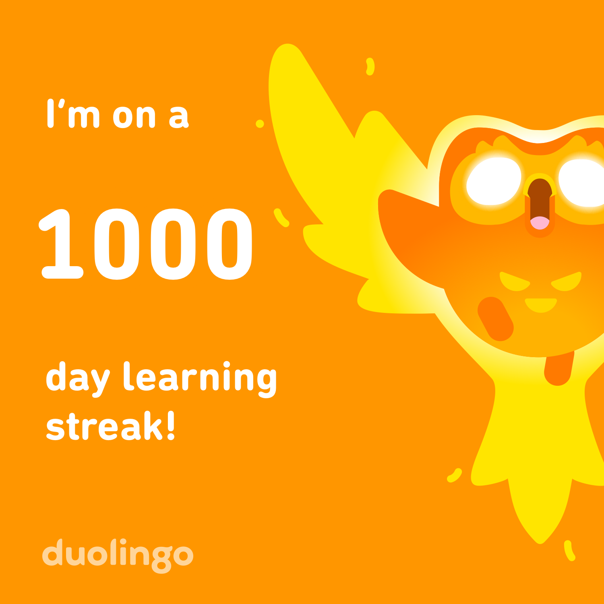

<h1 align="center">Hi 👋, I'm Jonas</h1>
<h3 align="center">Currently doing an internship at Siemens in Tokyo 🇯🇵</h3>

---

## 📚 Some other Personal Projects

### 🦉 1000+ Day Duolingo Streak

  

I maintained a 1000+ day learning streak on Duolingo — daily consistency over nearly 3 years.

---

### 📖 WaniKani (Japanese Kanji Learning)

Already learned 300+ Kanji.
➡️ My profile: https://www.wanikani.com/users/KanjiJota

---

### 🧘 650+ Days of Meditation (Waking Up App)

  

650+ days of meditation practice using the Waking Up app.
